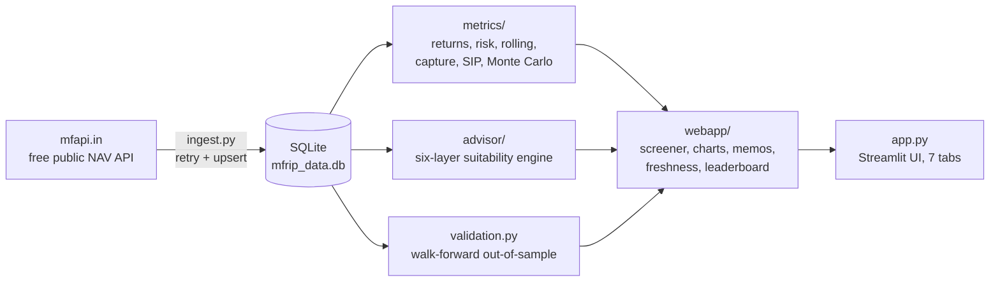

# MFRIP Architecture

A map of how the system fits together, for developers evaluating the codebase.
The finance methodology itself lives in [METHODOLOGY.md](METHODOLOGY.md); this
document covers structure and data flow.

## Data flow

## Layers

**Ingestion and storage.** `mfrip/ingest.py` downloads scheme metadata and NAV
history from mfapi.in with retries and backoff, upserting into a small SQLite
database (`mfrip/store/`). The deployed app ships with a seed database and
keeps itself current through `webapp/freshness.py`: on startup, if the newest
NAV is more than 4 days old, it re-fetches every cached fund once per day per
server, and the header always states "data to <date>".

**Point-in-time discipline.** All historical analysis cuts the NAV series at
the as-of date before computing anything (`metrics/returns.py`), so no number
can quietly use information from the future. This no-lookahead rule is enforced
by a dedicated integrity test.

**Metrics.** `mfrip/metrics/` holds the quantitative core: trailing and
calendar-year returns, annualised risk, Sharpe/Sortino, drawdowns, rolling
windows, up/down capture, historical stress episodes, SIP XIRR, and a
Monte Carlo SIP simulator (bootstrap and Gaussian paths, verified against the
closed-form annuity value at zero volatility).

**Advisor.** `mfrip/advisor/` is a six-layer rules engine: risk profiling,
constraints, allocation, within-category fund ranking (percentile-based
composite), portfolio construction, and validation with a health score. Rules,
not machine learning, so every verdict can be explained line by line.

**Self-testing.** `mfrip/validation.py` runs walk-forward validation of the
engine's own ranking: rank funds using only data before a cutoff, then measure
what they actually did next, across multiple train/test windows, scored with
Spearman rank correlation and permutation p-values. The validator itself is
tested against synthetic funds with known persistence.

**Web layer.** `mfrip/webapp/` contains the screener, Plotly chart factory
(single palette constants), research memo generator, bootstrap for fresh
servers, and freshness. `app.py` is the Streamlit shell: seven tabs, one CSS
block, and a Beginner mode that adds plain-language explainers everywhere.

## Testing philosophy

135 pytest tests. The pattern throughout: every statistical routine gets at
least one control test with a mathematically known answer (zero-volatility
Monte Carlo equals the closed-form SIP value; a constant-growth NAV produces
exactly its implied CAGR; the walk-forward validator must find signal in
synthetic persistent funds and none in randomised ones). UI-adjacent logic is
tested through Streamlit's AppTest harness and, before releases, the running
app is driven headlessly with Playwright at desktop and phone widths.

## Deployment

Streamlit Community Cloud, free tier, rebuilt automatically on every commit to
`main`. The filesystem is ephemeral, so the committed seed database plus the
daily self-refresh give instant startup and current data without any paid
infrastructure.
