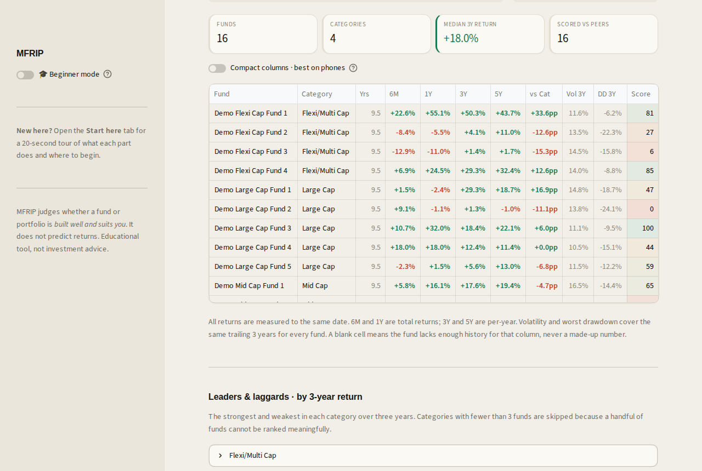
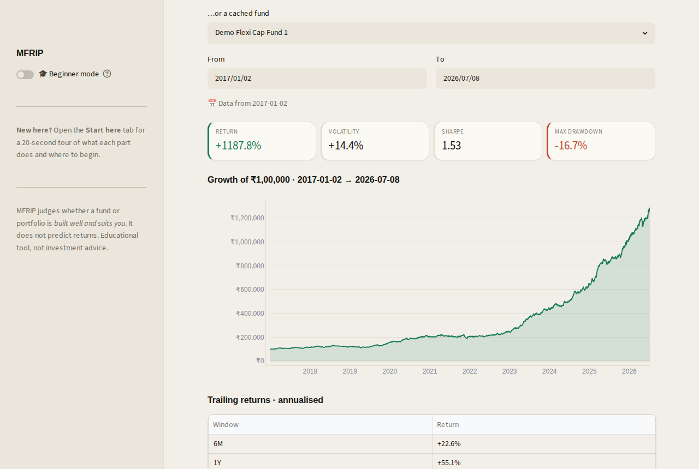

MFRIP

Mutual Fund Research & Intelligence Platform

An explainable suitability engine for Indian mutual funds, built to show its work.

🚀 Open the live app  ·  no install, no signup, works on any phone or laptop

Show Image Show Image Show Image Show Image Show Image

The one-line pitch

Most fund tools quietly promise to tell you what will go up. MFRIP refuses to.
It cannot know the future, and it says so, in the app, on screen, every time.
What it does instead: take a fund or a portfolio, run it through a transparent,
rules-based engine, and hand you back a verdict you can trace line by line
back to real numbers, not a black box.

Educational tool, not investment advice. Past performance does not predict future returns.

 
Contents

See it in 2 minutes
A look inside
What it does
How it works
Honest limitations
Run it locally
Deploy your own
Testing
Tech stack & project layout
Architecture & methodology
Author

 
See it in 2 minutes

StepWhat to do1️⃣Open the live app and flip on 🎓 Beginner mode in the sidebar2️⃣Go to Explore a fund, search any of 37,000+ Indian funds by name, and scroll: returns, risk, crash behaviour, and a Monte Carlo goal planner for your SIP3️⃣Try the Screener to line up every fund side by side, or Advisor to get a health check on funds you already own4️⃣Check the header: it always says "data to <date>", because the app refreshes its own NAVs daily and never hides how current the numbers are

Found something confusing or broken? Open an issue or reach out directly, that feedback genuinely shapes what gets built next.

 
A look inside

<table>
<tr>
<td width="33%"><b>Start here</b> </td>
<td width="33%"><b>Screener</b> </td>
<td width="33%"><b>Explore a fund</b> </td>
</tr>
</table>
Screenshots use a small demo dataset. Open the live app to search real Indian funds.

 
What it does

<b>🔄 Self-refreshing data</b>
 
Checks its own data age on startup. When the newest NAV is more than a few
days stale, it re-fetches everything cached from mfapi.in, once a day, and
shows "data to <date>" in the header so freshness is never a guess. If the
source is briefly unreachable, the app opens anyway with what it has, and
says so on screen.

<b>🔍 Screener</b>
 
Every fund in one comparable table: returns across 6M/1Y/3Y/5Y measured to a
common date (not each fund's own last update), risk over a common 3-year
window, return versus the category median, and MFRIP's percentile-based
quality score. Searchable, filterable by category, with leaders and laggards
by 3-year return.

<b>📈 Explore a fund</b>
 
Returns, risk, the full distribution of every rolling 1/3/5-year return
(not just one lucky window), up/down capture against the fund's own category
index, behaviour during real past market shocks, a SIP/XIRR calculator, and a
Monte Carlo goal planner that simulates thousands of possible futures and
shows the probability fan, not a single fake number.

<b>⚖️ Compare funds</b>
 
Head-to-head over a common window, with a period-by-period breakdown of who
led and why.

<b>🧪 Portfolio Lab</b>
 
Build and compare portfolios side by side: growth, risk, allocation, and a
fund-correlation heatmap so you can see if your "diversified" portfolio
actually is.

<b>📄 Research</b>
 
Audits whether an advisor's past recommendations actually beat a fair
benchmark, generates research memos, saves portfolios, ranks them on a
leaderboard, and runs walk-forward validation: out-of-sample proof of
whether the engine's own ranking predicts anything at all, or is just noise.

<b>🩺 Advisor</b>
 
Enter the funds you hold and get a verdict, a Portfolio Health Score,
plain-language strengths and weaknesses, allocation gaps, specific add/trim
suggestions, and a head-to-head backtest of your mix against a suggested one.

A Start here tab orients first-time users, and 🎓 Beginner mode adds
plain-language explanations under every metric and score, everywhere in the app.

 
How it works

NAV history comes from the free mfapi.in and is
cached in SQLite under strict point-in-time, no-lookahead discipline: a
fund is only ever judged on data that existed at the time. On top of that sits
a tested analytics engine (rolling returns, capture ratios, stress tests,
SIP/XIRR, risk metrics) and a transparent six-layer suitability engine
(profile → constraints → allocation → fund ranking → construction →
validation) that ends in a Portfolio Health Score.

Every output is computed from real numbers, and every recommendation is
templated from those numbers. Nothing is a black box. Full detail in
METHODOLOGY.md.

 
Honest limitations

LimitationWhat that meansNo return predictionMFRIP judges suitability and quality, never future performance, by design, not by omissionNo expense ratio or AUMNot in the free data source, so fund ranking uses only NAV-derived factors, and the scoring weights say so on screenHoldings overlap is approximatedBy return correlation ("these funds move together"), since stock-level holdings aren't available for freeData source is free and publicIt can occasionally lag or briefly return an incomplete list, and the app is built to say so rather than hide it

 
Run it locally

Requires Python 3.10+.

bashpip install -r requirements.txt

# one-time data setup
python -m mfrip.cli sync-schemes               # download the fund master list
python -m mfrip.cli load-all recommendations   # load the advised plans
python -m mfrip.cli fetch-all                  # download NAVs for those plans + benchmark

# launch
python -m streamlit run app.py

Then open the URL it prints (usually http://localhost:8501).

Windows note: if your username contains a space, use
python -m streamlit run app.py, not the bare streamlit launcher.

 
Deploy your own copy

Streamlit Community Cloud, free tier:

Push this repo to GitHub.
At share.streamlit.io, create an app pointing at app.py.
On first load the app bootstraps itself: it detects the empty database and downloads the scheme list, advised plans, and NAVs automatically (about a minute, shown with a progress panel).

<b>Faster, more reliable startup (recommended)</b>
 
Streamlit Cloud's filesystem is ephemeral and wipes on restart, so bootstrap
re-runs after periods of inactivity. To make startup instant and remove the
dependency on the data source being responsive at that exact moment, build the
database locally (the three CLI commands above) and commit it:

bashgit add -f mfrip_data.db
git commit -m "Add seed database for instant startup"

The default .gitignore excludes mfrip_data.db; -f overrides that
intentionally. Note: portfolios saved on the live site won't persist across
restarts on the free tier, a platform limitation, not a bug.

 
Testing

bashpip install pytest
python -m pytest -q

135 tests, covering the financial math (including XIRR validated against a
flat-NAV control and capture ratios checked against known aggressive/defensive
cases), the suitability engine, point-in-time reconstruction, benchmark
resolution, and the portfolio/leaderboard logic. Every statistical routine
carries at least one control test with a mathematically known answer.

 
Tech stack

Python · Streamlit · pandas · NumPy · Plotly · SQLite · mfapi.in (data)

<b>Project layout</b>
 
app.py                    Streamlit UI (seven tabs)
mfrip/
  config.py               risk-free rate, benchmark, asset proxies
  ingest.py                scheme master + NAV download (retry/backoff)
  store/                  SQLite layer: nav_store, saved portfolios
  metrics/                returns, risk, rolling, capture, sip, relative
  portfolio/              point-in-time reconstruction, audit, backtest
  advisor/                six-layer suitability engine + glossary
  webapp/                 charts, portfolio_lab, research, benchmarks,
                          leaderboard, bootstrap, freshness, data access
  recommend/              recommendation schema + YAML loader
  cli.py                  command-line tools
recommendations/          advised plans (YAML)
tests/                    135 tests
docs/screenshots/         README images
ARCHITECTURE.md           system map and data flow
METHODOLOGY.md            every formula and rule, stated plainly
CONTRIBUTING.md           ground rules for contributions
LICENSE                   MIT

 
Architecture & methodology

ARCHITECTURE.md : the system map, data-flow diagram, and testing philosophy.
METHODOLOGY.md : every formula and rule behind every number, stated plainly.
CONTRIBUTING.md : ground rules for anyone who wants to extend this.

 
Author

Built by Akhand Raj, a dual-degree student (M.Sc. Economics + B.E.
Mechanical Engineering) at BITS Pilani Hyderabad, targeting quantitative risk
and markets roles.

Questions, feedback, or bug reports: open an issue.

🔗 mfripfixed.streamlit.app

MIT License · See LICENSE

